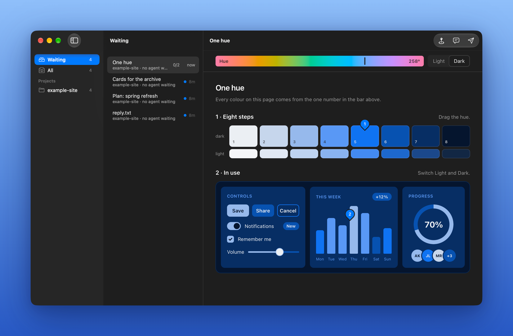

# Bridge

Agents write faster than we can read. The human world is much more visual. Bridge connects the two: the agent builds visual pages from ready-made components, and what you click and point at goes back to it using a hook.

Inspired by [Planning with Agents](https://maggieappleton.com/planning-agents).



Requires macOS 27 on Apple silicon.

```
/plugin marketplace add medienbaecker/bridge
/plugin install bridge@bridge
```

MIT
